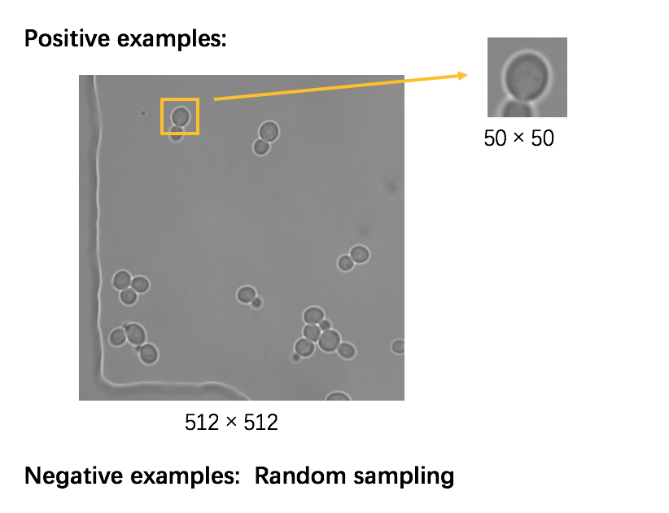
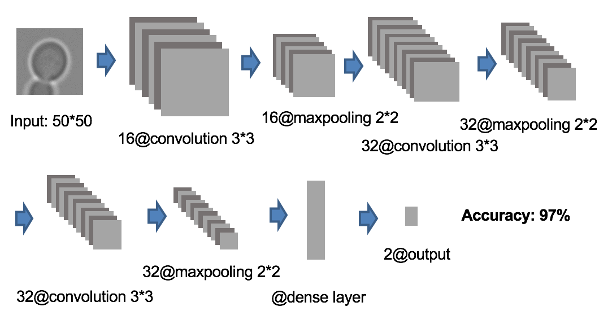
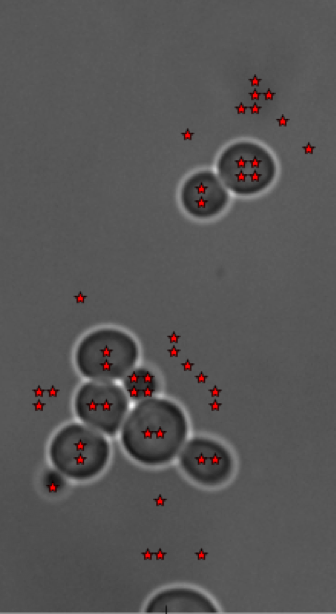
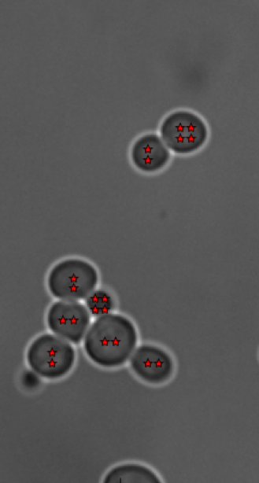
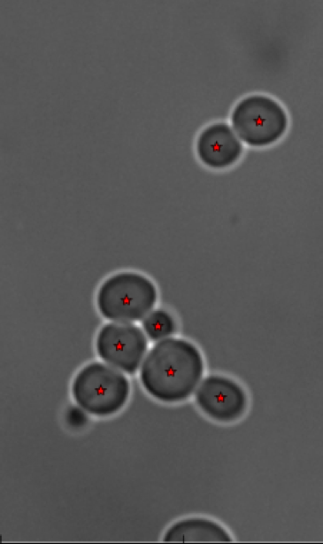
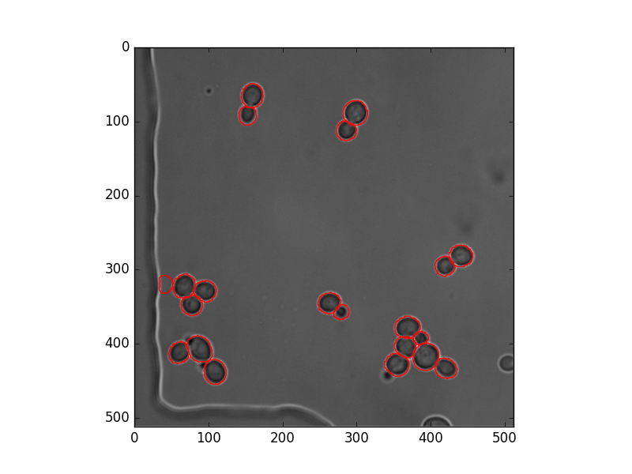
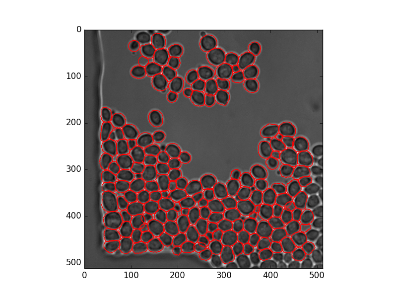

# deepYeast
Fully Automated Tool for Yeast Cell Detection and Segmentation in Microscopic Images
###### Tanqiu Liu

## Introduction
In biological research, even though the experiment is applied to a number of cells equally, the responses of cells varies greatly. Therefore, we usually want to extract single cell data. For fluorescnt microscopy experiments, we may want to record the dynamics a certain kind of protein in a single cell. It is required to do the segmentation before data extraction to detect sub-regions of an image which represent single cells. **deepYeast** is develop to address the problem of detecting the yeast cell contour.

A sample image：

## Methods
The detection process consists of 2 steps: 1) locating cell centers with a convolutional neural network(CNN), 2) detecting cell contour.

1. Locating cell centers with a convolutional neural network(CNN)
A convolutional neural network model was developed to automatically identify the location of the cell centers. The pipeline employed a sliding window approach for detection. That is , a small window slides across the entire image and for position output whether the position is the center of a cell or not. 
The training data was extracted and transformed from raw .csg files which are manually labeled by former researchers. Positive examples are obtained by generating a window centered on the center of the cell. Negative examples are obtained by random sampling outside the cells.

The convolutional neural network consists of three convolutional layers and two dense layers. The CNN predicts whether the current window is a cell. 

For each image, the sliding window method predicts a set of points which are candidates of centers of cells. Following postprocessing of these candidates includes discard points outside the cells and merge points in the cells. Finally we get precise and robust predictions of centers of cells.

        

1.Detecting cell contour
A dynamic programming algorithm was developed to detect the contour of single cell given a seed point at the center of the cell. 
The principal algorithm is :
1) generate a series of rays of different direnctions from the seed of the cell detected,
2) compute several images which include pix_image, gradx, grady, grad_from_center...
3) get the values of each image on all points on the rays, which is named tab, pixtab, gxtab, gytab...
4) find out the optimal pathway(dynamic programming) through all of the rays which best represents the cell contour (manually defined scoring function)
5) filter the optimal pathway and get the polygon/mask of the cell

Sample results:

      
